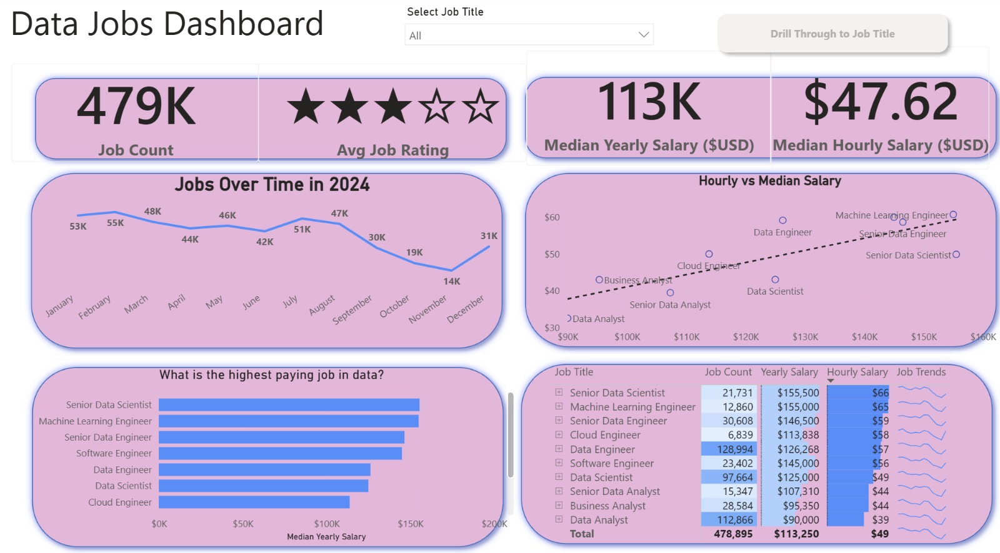
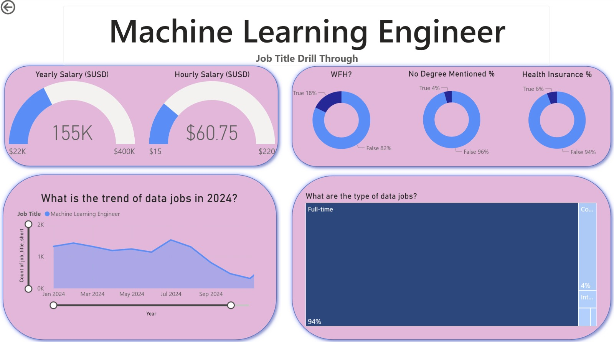
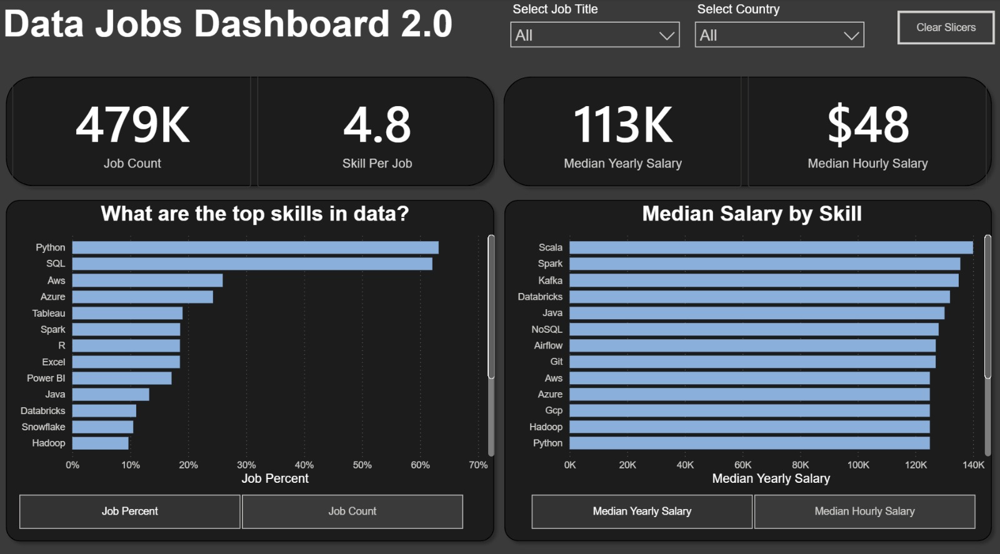

# 📊 Data Job Market Analysis Dashboard

**Impact:** This dashboard helps job seekers and data professionals make **data-driven career decisions** by uncovering market trends, compensation patterns, and role characteristics.

---
## 🧠 Project Summary
This project is an end-to-end **data analytics and visualization** study of the global data jobs market, built using **Power BI**.  

This is a **2-part Power BI project** that explores the data job market from both a **macro (market-level)** and **micro (skill-level)** perspective.

- **Part 1 — Market Analysis Dashboard**  
  Focuses on job demand, salary trends, and role characteristics  

- **Part 2 — Skills Intelligence Dashboard (v2.0)**  
  Focuses on **skills demand, salary by skill, and skill-job relationships**

Together, these dashboards transform raw job posting data into **actionable career insights**.

The goal was to transform raw job data into **actionable insights** about:
- Job demand trends  
- Salary distributions across roles  
- Employment characteristics  
- Market dynamics within the data industry  

Through interactive dashboards and drill-through capabilities, this project enables users to explore both **high-level trends** and **role-specific insights**.

---

## 🎯 Problem Statement
The data job market is rapidly evolving, but job seekers often lack clarity on:
- Which roles are most in demand  
- Which roles offer the highest compensation  
- How job demand changes over time  
- What job requirements (e.g. degree, remote work) look like  

This project addresses these gaps by providing a **data-driven view of the job market**.

---

## 🛠️ Tools & Skills Demonstrated

**Power BI**
- Interactive dashboard design with drill-through functionality  
- Created **custom KPIs using DAX** (e.g. normalized star rating from 0–5)  
- Data organization within Power BI to enable cross-filtering and drill-through    

**Data Analysis**
- Trend analysis of job demand and salary distributions  
- Comparative analysis across different data roles  
- KPI design and interpretation for market insights  

**Data Storytelling**
- Translating complex datasets into clear, actionable insights  
- Designing visuals to support intuitive decision-making   

---

### ⚙️ Technical Depth
 - Designed **custom KPIs using DAX** (e.g. normalized star rating)  
- Enabled **interactive filtering and drill-through** for role-level analysis  
- Structured dashboards for **clarity, comparability, and interactivity**, ensuring intuitive navigation across visuals  
- Optimized visuals for **actionable insights**, e.g. salary comparisons and demand trends

---

## 📊 Dashboard Overview

### 🔹 Main Dashboard (Market Overview)


This dashboard provides a **macro-level view** of the data job market.

#### 📌 Key KPIs
- **Total Job Listings** 
- **Average Job Rating**
- **Median Yearly Salary**
- **Median Hourly Salary**

#### 📈 Key Analyses

**1. Job Demand Over Time**  
- Tracks monthly job postings  
- Reveals **seasonal hiring trends** and demand fluctuations  

**2. Salary Comparison Across Roles**  
- Scatter plot comparing **hourly vs yearly salary**  
- Salary ranges vary by role and seniority, providing useful benchmarks for career planning.
  - Data Analyst  
  - Data Scientist  
  - Data Engineer  
  - Senior Data Scientist  
  - Machine Learning Engineer  
  - Senior Data Engineer  

**3. Job Distribution Table**  
- Combines:
  - Job count  
  - Salary metrics  
  - Embedded trend indicators  
- Enables **quick comparison across roles**

**4. Interactive Filtering**  
- Users can filter by job title  
- Supports deeper exploration via drill-through  

---

### 🔹 Drill-Through Dashboard (Role-Level Analysis)


This view enables **deep-dive analysis** into a specific role (e.g. Machine Learning Engineer).

#### 💰 Salary Insights
- Median Yearly Salary
- Median Hourly Salary  
- Gauge visuals provide **contextual benchmarking within salary ranges**

#### 🧩 Job Characteristics
- **Remote Work (WFH)** 
- **No Degree Requirement**  
- **Health Insurance Offered** 


#### 📈 Trend Analysis
- Tracks demand for the selected role across the year
- Identifies **growth periods and downturns**

#### 🧱 Employment Type Distribution
- Majority are **Full-Time roles**  
- Small proportion of contract/internship roles  

---

## 🧠 Key Insights & Findings

### 💡 Market Demand
- Data roles show **strong and sustained demand**, with fluctuations across months  
- Hiring slows towards year-end, suggesting **seasonal hiring cycles**


### 🏢 Job Characteristics
- Majority of roles are **full-time**, indicating stability  
- Remote work and flexible requirements are **present but limited**  

---
## 🚀 How to Use
1. Open the `.pbix` file in Power BI Desktop  
2. Use the **job title slicer** to filter roles  
3. Click on visuals to **interact and explore relationships**  
4. Use **drill-through** to access detailed role-specific insights  

---

# 🚀 Part 2: Skills Intelligence Dashboard (v2.0) 



---

## 🔍 Overview

This dashboard builds on Part 1 by shifting focus from **job roles → skills intelligence**.

While Part 1 answers the question of  *“Which roles are valuable?”*,  
Part 2 answers:

- **Which skills are most in demand?**
- **What is the salary impact of specific skills?**
- **How do skills translate into job opportunities?**

This represents a deeper layer of analysis, moving from **market trends → actionable skill insights**.

---

## 🎯 Objective

To help users:
- Identify **high-demand skills** in the data industry  
- Understand the **salary impact of specific tools and technologies**  
- Evaluate how **skill combinations influence employability**  

---

## 📌 Key KPIs

- **Total Job Count**
- **Average Skills per Job**
- **Median Yearly Salary**
- **Median Hourly Salary**

---

## 🧠 Key Insights & Findings

### 1. Top Skills in Data
- Ranks skills based on job demand  
- Highlights widely required skills such as:
  - Python  
  - SQL  
  - AWS  
  - Azure  

👉 Insight: Foundational technical skills dominate across most roles.

---

### 2. Median Salary by Skill
- Compares salary levels across different skills  

👉 Insight: Specialized tools often yield **higher compensation** than general-purpose skills.

---

### 3. Skill Density (Skills per Job)
- Measures how many skills are expected per role  
- Reflects increasing demand for **multi-skilled candidates**

---

### 4. Interactive Filtering
- Filter by:
  - Job Title  
  - Country  
- Enables dynamic exploration of **skill demand across different contexts**

---


## ⚙️ Technical Implementation (Part 2 Focus)

This dashboard demonstrates deeper technical application in **data transformation and modelling**:

### 🔄 Data Preparation (Power Query & M Language)
- Loaded and combined datasets from:
  - CSV files  
  - External/structured sources  
- Cleaned and transformed raw data using **Power Query Editor**
- Applied transformations using **M Language**, including:
  - Handling null values  
  - Standardizing formats  
  - Creating structured datasets for analysis  

---

### 🧮 Data Modelling & DAX

#### Calculated Columns
- Created new columns using **DAX** to enrich the dataset  
- Enabled better categorization and analysis of job-skill relationships  

#### Measures (Explicit DAX Measures)
- Built custom measures such as:
  - Job Count  
  - Skill-based aggregations  
- Used DAX functions like:
  - `CALCULATE`  
  - `ALLSELECTED`  
  - `DIVIDE`  

---

### 🧠 Key Technical Challenge

A key challenge was correctly managing filter context in skill-level aggregations, as naïve calculations would produce misleading global percentages. I addressed this by leveraging ```ALLSELECTED``` within ```CALCULATE``` to compute context-aware distributions, ensuring metrics dynamically reflect user selections, rather than producing misleading global aggregates

Example:

```DAX
DIVIDE(
    [Job Count],
    CALCULATE([Job Count], ALLSELECTED(Skills))
)
